# DMS — Drawing Management System for Power Plant Operations

A full-stack web application for managing engineering drawings across power plant departments and components.

## Screenshots

### Login Page
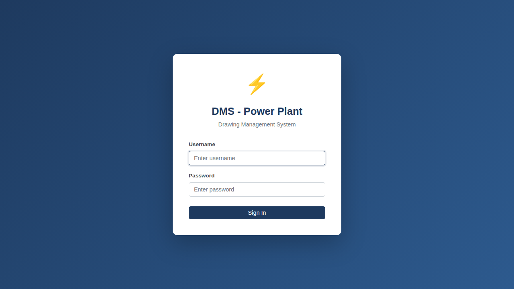

### Admin Dashboard
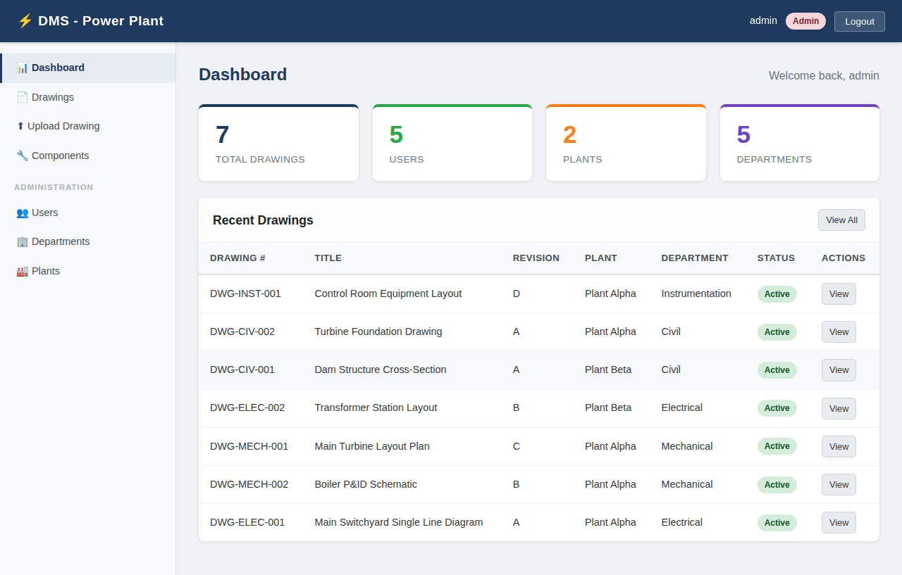

### Drawings List
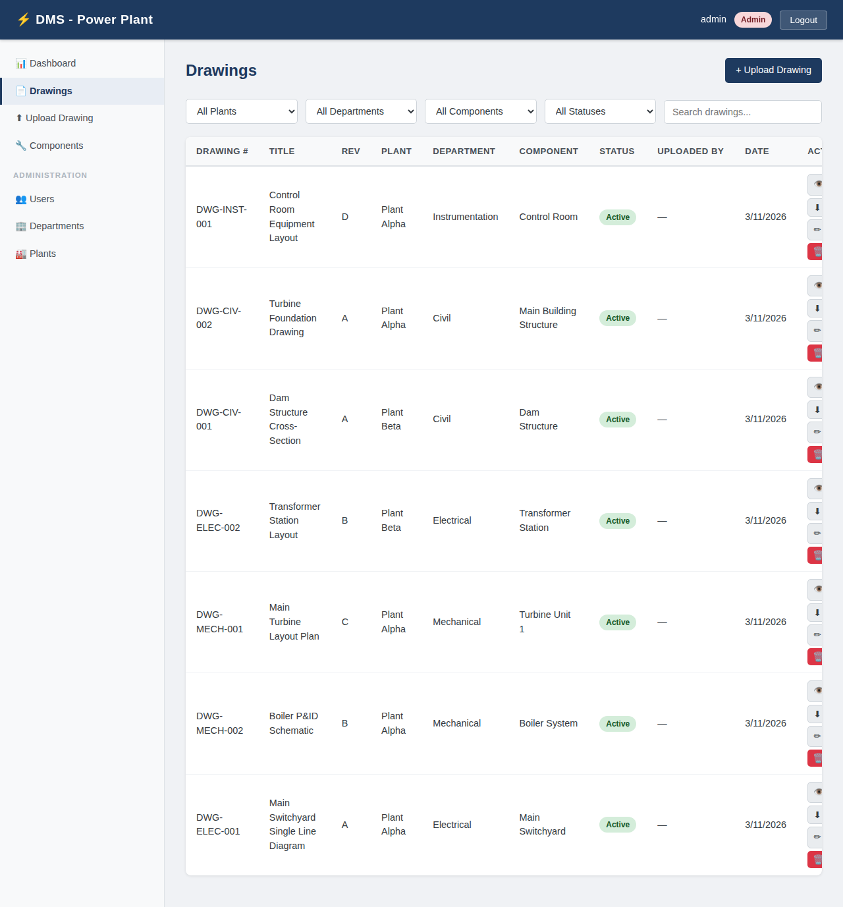

### Drawings Filtered by Plant
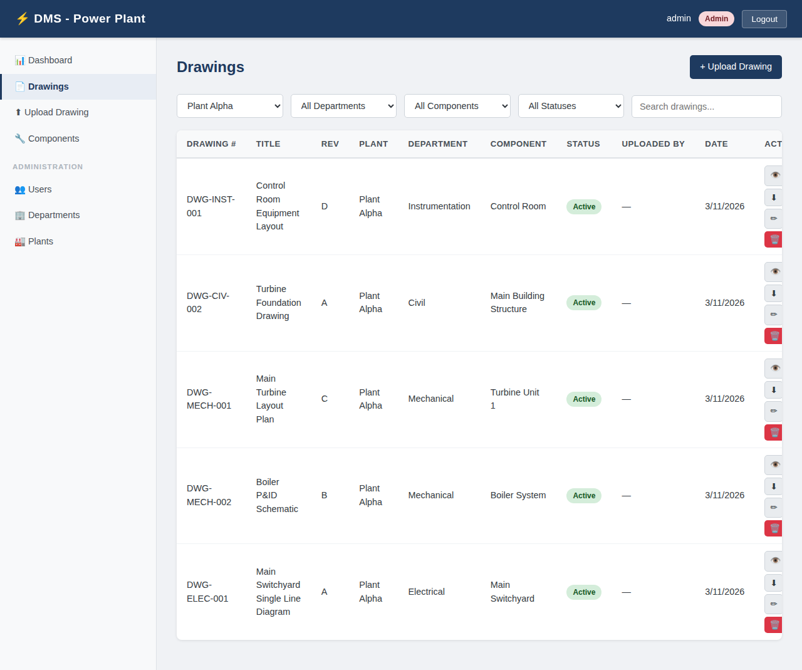

### Upload Drawing
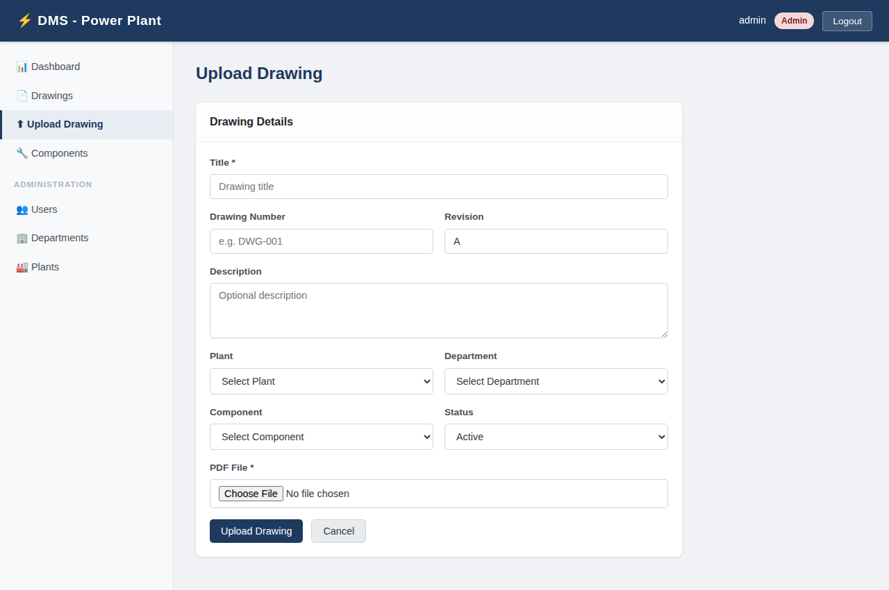

### Drawing Detail View
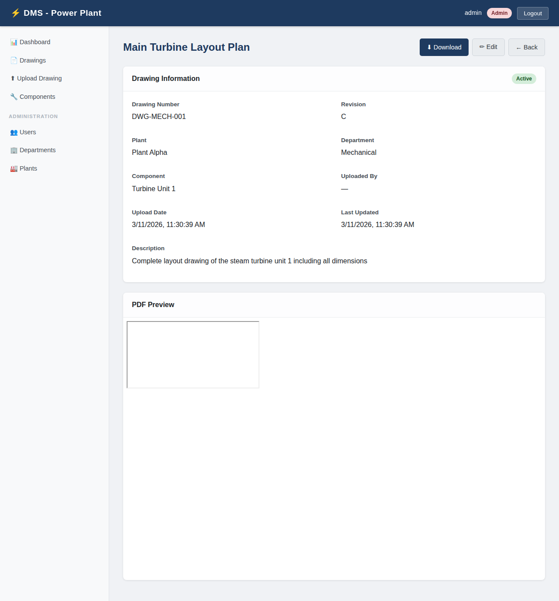

### Edit Drawing
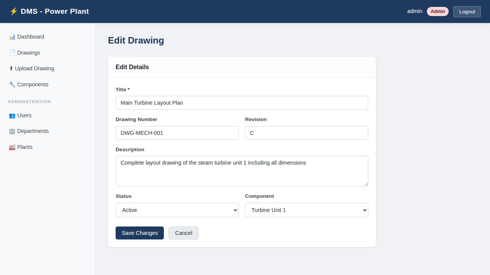

### User Management (Admin)
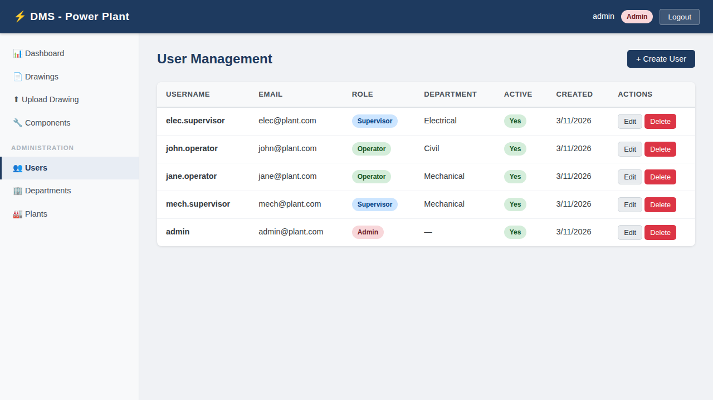

### Department Management (Admin)
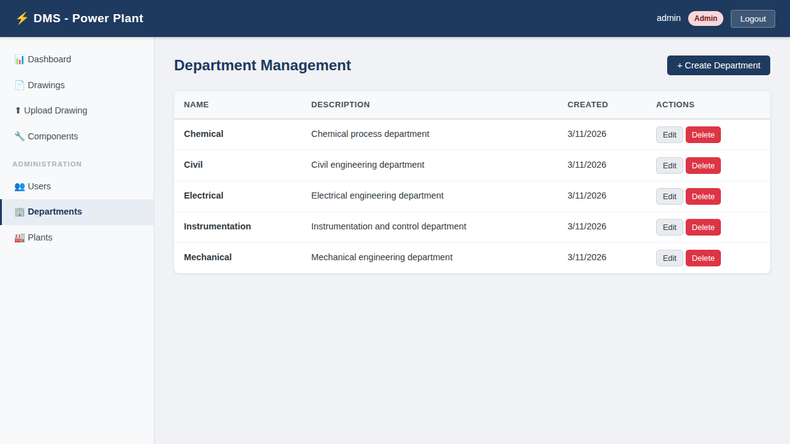

### Plant Management (Admin)
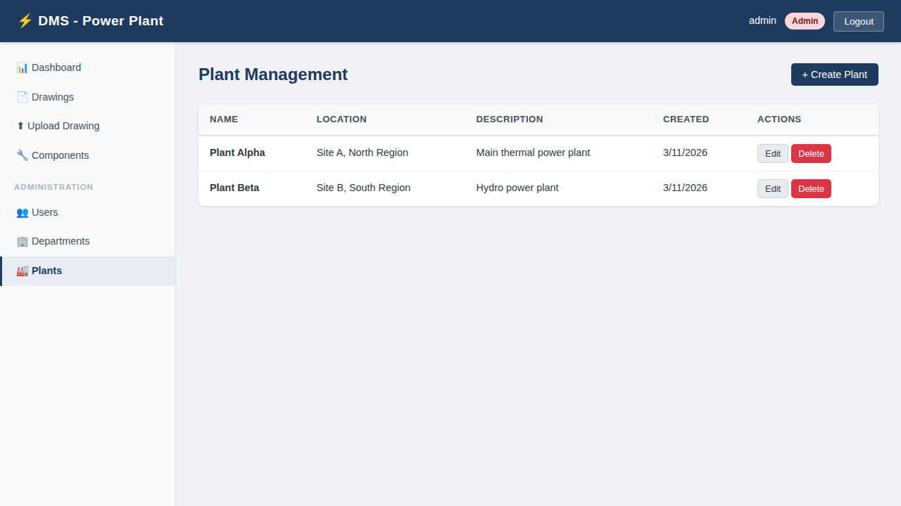

### Component Management (Admin / Supervisor)
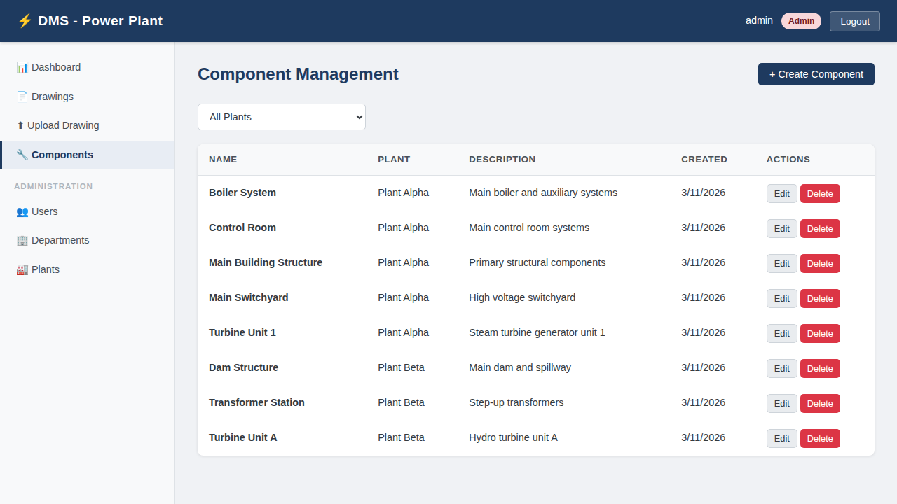

### Supervisor Dashboard
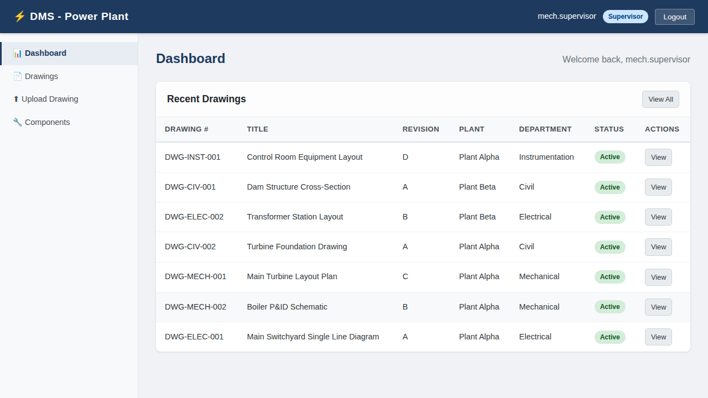

### Operator Dashboard
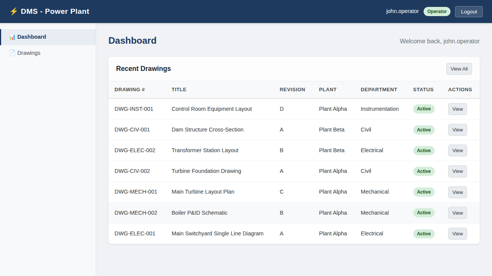

### Convert to AutoCAD — Drawing Detail
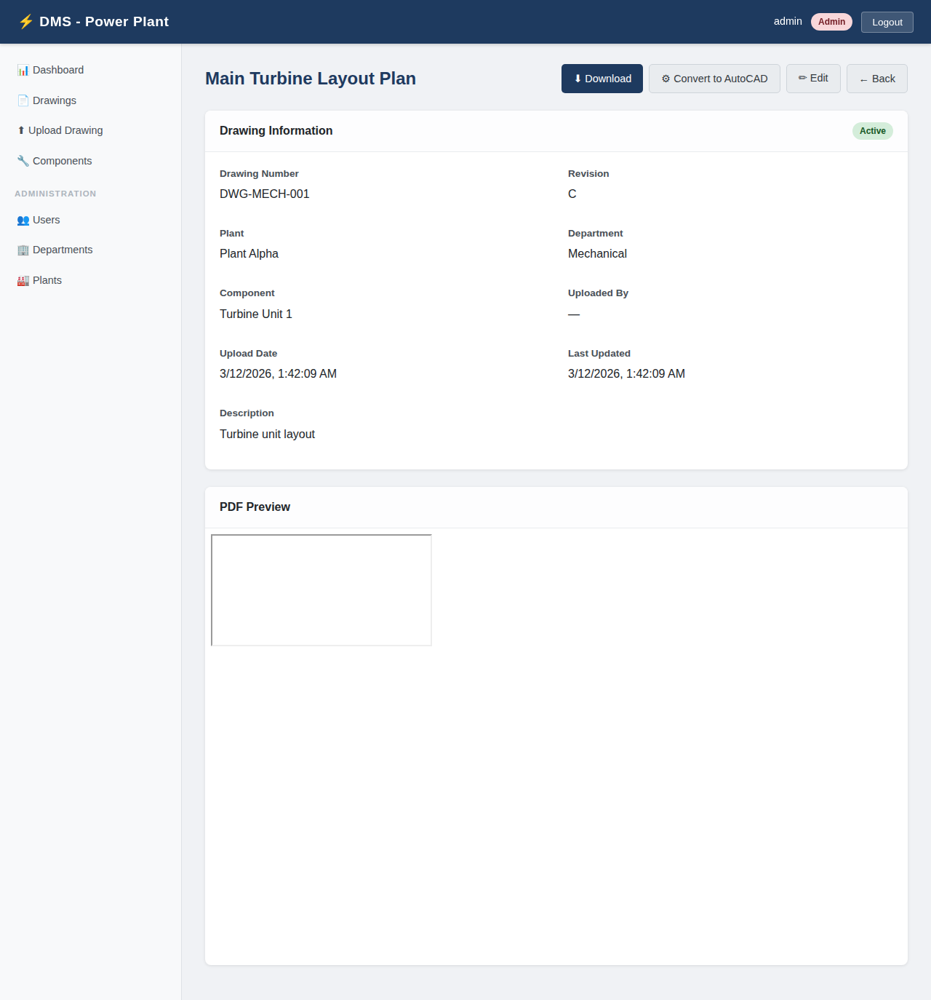

### Convert to AutoCAD — Drawings List (⚙ icon in actions column)
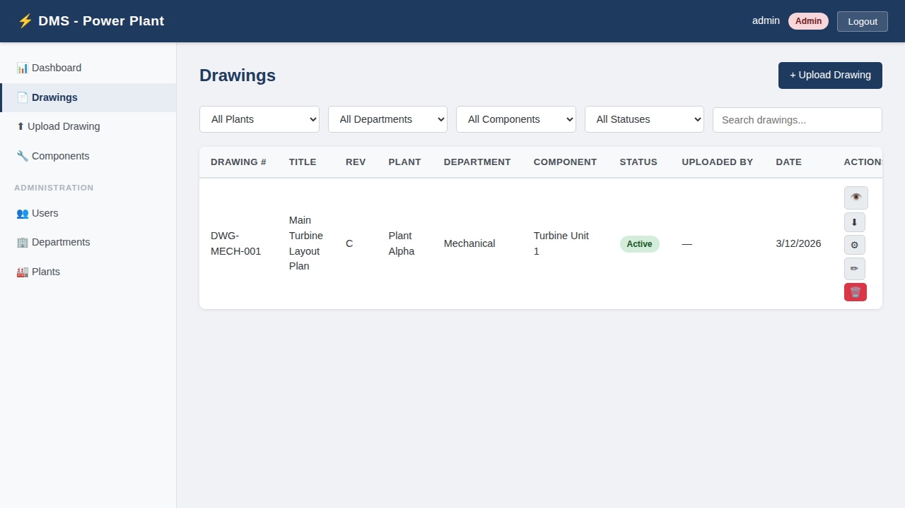

## Features

- **Role-based access control**: Admin, Supervisor, and Plant Operator interfaces
- **User lifecycle management**: Create, edit, deactivate users with role/department assignments
- **Department management**: Civil, Mechanical, Electrical, Instrumentation, Chemical
- **Plant & Component management**: Hierarchical plant → component structure
- **Drawing lifecycle**: Upload PDF drawings, edit metadata, archive, delete
- **Grouped views**: Browse drawings grouped by plant component
- **Search & filter**: Filter drawings by plant, department, component, status, or keyword
- **PDF viewer**: In-browser PDF viewing with authenticated download
- **PDF → AutoCAD conversion**: One-click conversion of any drawing PDF to AutoCAD DXF via an on-premise vision language model deployed through [vllm](https://github.com/vllm-project/vllm)

## Tech Stack

| Layer | Technology |
|-------|-----------|
| Frontend | React 18, Vite, React Router v6, Axios |
| Backend | Node.js, Express 4 |
| Database | MySQL 8 |
| Auth | JWT (jsonwebtoken) + bcryptjs |
| File Upload | Multer (PDF only, 50 MB limit) |
| PDF Rendering | Ghostscript (server-side PDF → PNG rasterisation) |
| CAD Conversion | On-premise vllm (OpenAI-compatible vision LLM endpoint) → DXF R12 |

## Project Structure

```
DMS/
├── client/          # React frontend (Vite)
│   ├── src/
│   │   ├── context/     # Auth context (JWT, roles)
│   │   ├── services/    # Axios API client
│   │   ├── components/  # Layout, PrivateRoute
│   │   └── pages/       # Login, Dashboard, Drawings, Admin pages
│   └── .env.example
├── server/          # Express REST API
│   ├── src/
│   │   ├── config/      # MySQL connection pool
│   │   ├── middleware/  # JWT auth, Multer upload
│   │   ├── routes/      # auth, users, departments, plants, components, drawings, convert
│   │   └── utils/       # pdfToImage, dxfWriter, vllmClient
│   ├── uploads/         # PDF storage (git-ignored)
│   ├── init.sql         # Database schema + seed data
│   └── .env.example
└── README.md
```

## Setup

### Prerequisites
- Node.js 18+
- MySQL 8.0+

### 1. Database

```bash
# Log into MySQL and run the init script
mysql -u root -p < server/init.sql
```

This creates the `dms_db` database with schema and seed data (departments, plants, components).

### 2. Backend

```bash
cd server
cp .env.example .env
# Edit .env — set DB_PASSWORD and JWT_SECRET
npm install
npm run dev     # development (nodemon)
# or
npm start       # production
```

The API server starts on **http://localhost:5000**.

### 3. Frontend

```bash
cd client
cp .env.example .env    # optional, defaults to http://localhost:5000/api
npm install
npm run dev             # development
# or
npm run build && npx serve dist   # production preview
```

The frontend dev server starts on **http://localhost:5173**.

### 4. Create Admin User

After starting the server, register the first admin:

```bash
curl -X POST http://localhost:5000/api/auth/register \
  -H "Content-Type: application/json" \
  -d '{"username":"admin","email":"admin@plant.com","password":"Admin123!","role":"admin"}'
```

> **Note:** The first `POST /api/auth/register` call is open. Subsequent registrations require an `admin` JWT.

## API Overview

| Method | Path | Description | Roles |
|--------|------|-------------|-------|
| POST | `/api/auth/login` | Login, get JWT | Public |
| POST | `/api/auth/register` | Register user | Admin (or first user) |
| GET | `/api/auth/me` | Current user | Authenticated |
| GET | `/api/users` | List users | Admin, Supervisor |
| POST/PUT/DELETE | `/api/users` | Manage users | Admin |
| GET | `/api/departments` | List departments | Authenticated |
| POST/PUT/DELETE | `/api/departments` | Manage departments | Admin |
| GET | `/api/plants` | List plants | Authenticated |
| GET | `/api/plants/:id/components` | Components in plant | Authenticated |
| POST/PUT/DELETE | `/api/plants` | Manage plants | Admin |
| GET | `/api/components` | List components | Authenticated |
| POST/PUT | `/api/components` | Manage components | Admin, Supervisor |
| DELETE | `/api/components/:id` | Delete component | Admin |
| GET | `/api/drawings` | List/filter drawings | Authenticated |
| GET | `/api/drawings/by-component` | Drawings grouped by component | Authenticated |
| POST | `/api/drawings` | Upload drawing (PDF) | Admin, Supervisor |
| PUT | `/api/drawings/:id` | Update drawing metadata | Admin, Supervisor |
| DELETE | `/api/drawings/:id` | Delete drawing | Admin, Supervisor |
| GET | `/api/drawings/:id/download` | Download PDF | Authenticated |
| POST | `/api/drawings/:id/convert` | Convert PDF → AutoCAD DXF via vllm | Authenticated |

## User Roles

| Role | Capabilities |
|------|-------------|
| **Admin** | Full access: manage users, departments, plants, components, drawings |
| **Supervisor** | Manage drawings and components in their department |
| **Operator** | Browse, search, and view/download drawings |

---

## PDF → AutoCAD Conversion Feature

Every drawing stored in DMS can be converted to an **AutoCAD DXF file** with a single click.  
The conversion uses an **on-premise Vision Language Model (VLM)** deployed through [vllm](https://github.com/vllm-project/vllm), keeping all engineering data within the organisation's infrastructure.

### User Interface

| Location | Control |
|----------|---------|
| Drawing Detail page | **⚙ Convert to AutoCAD** button (top-right action bar) |
| Drawings List page | **⚙** icon button in the Actions column for each row |

Both controls show a loading spinner during conversion and display a toast notification on success or failure.

### Conversion Pipeline

```
PDF file (on server)
       │
       ▼
[1] Ghostscript (gs)
    Rasterise page 1 → PNG at 150 dpi
       │
       ▼
[2] vllm (OpenAI-compatible /v1/chat/completions)
    Vision-capable LLM analyses the PNG and returns
    a structured JSON description of all drawing entities
    (lines, circles, arcs, polylines, text, dimensions…)
       │
       ▼
[3] DXF Writer (server/src/utils/dxfWriter.js)
    Converts JSON entity list to DXF R12 format
    (compatible with AutoCAD R12 onwards and all CAD viewers)
       │
       ▼
DXF file streamed to browser as a download
```

### Supported DXF Entity Types

The VLM is prompted to extract these entity types (see `server/src/utils/vllmClient.js`):

| DXF Entity | Used for |
|------------|----------|
| `LINE` | Walls, structural members, borders, dimension lines |
| `CIRCLE` | Flanges, bolt holes, valves, round equipment |
| `ARC` | Elbows, partial circles, curved features |
| `POLYLINE` | Complex outlines, pipe runs, profiles |
| `RECTANGLE` | Equipment outlines, rooms, title blocks |
| `TEXT` | Labels, annotations, title block text |

### Setup: vllm

1. **Install vllm** on the on-premise GPU server:

   ```bash
   pip install vllm
   ```

2. **Start the vllm server** with a vision-capable model:

   ```bash
   # LLaVA-1.6 (recommended — good balance of accuracy and speed)
   python -m vllm.entrypoints.openai.api_server \
     --model llava-hf/llava-v1.6-mistral-7b-hf \
     --dtype bfloat16 \
     --max-model-len 8192

   # Alternative: Qwen2-VL (higher accuracy on technical drawings)
   python -m vllm.entrypoints.openai.api_server \
     --model Qwen/Qwen2-VL-7B-Instruct \
     --dtype bfloat16

   # Alternative: InternVL2 (strong on structured documents)
   python -m vllm.entrypoints.openai.api_server \
     --model OpenGVLab/InternVL2-8B \
     --dtype bfloat16
   ```

3. **Install Ghostscript** on the DMS server (required for PDF → PNG rasterisation):

   ```bash
   # Ubuntu / Debian
   sudo apt-get install -y ghostscript

   # RHEL / CentOS
   sudo yum install -y ghostscript
   ```

4. **Configure DMS server** — add these to `server/.env`:

   ```env
   VLLM_BASE_URL=http://<your-vllm-host>:8000/v1
   VLLM_MODEL=llava-hf/llava-v1.6-mistral-7b-hf
   VLLM_API_KEY=          # leave blank if running without auth
   VLLM_TIMEOUT_MS=120000 # 2-minute timeout for slow inference
   VLLM_MAX_TOKENS=4096
   ```

### Rate Limiting

The conversion endpoint is rate-limited separately from the general API:  
**10 conversions per 10 minutes per IP** (each call invokes the VLM, which is GPU-intensive).  
This limit is configured in `server/src/app.js` via the `convertLimiter`.

---

## Literature Survey: PDF-to-CAD Conversion

The following is a survey of state-of-the-art approaches for converting engineering drawing PDFs to CAD formats, which informed the design of this feature.

### 1. Classical Computer-Vision Pipelines

Early work decomposed the problem into rasterisation → vectorisation → entity classification:

- **Vectorisation approaches** (potrace, autotrace, Inkscape): convert raster lines to SVG paths but lack semantic understanding of CAD primitives.
- **Hough Transform** (Duda & Hart, 1972): detects lines and circles; remains a baseline for symbol-free technical drawings.
- **Graphics Recognition (GREC) workshops** (1995–2017): a long-running research community producing benchmark datasets and rule-based parsers for specific drawing classes (circuit diagrams, floor plans, P&IDs).
- **Ramer–Douglas–Peucker algorithm**: polyline simplification used in most classical vectorisation pipelines.

**Limitation**: These methods are brittle — they require per-domain handcrafted rules and fail on noisy scans, complex overlapping symbols, or drawings outside the training domain.

### 2. Deep-Learning Approaches

Convolutional and transformer-based models improved generalisation:

- **DocParser** (Staar et al., 2022 — IBM Research): hierarchical graph transformer for structured document parsing; applied to engineering drawings to extract tables, title blocks, and region boundaries.  
  *Inspired*: our structured JSON extraction schema (title block, canvas dimensions, entity list).

- **P&ID digitisation** (Rahul et al., 2020 — *arXiv:2001.09684*): two-stage pipeline — Mask R-CNN for symbol detection followed by graph construction for piping connectivity. Achieves ~85 % symbol recognition on ISA-standard P&IDs.

- **FloorplanTransformation** (Liu et al., 2017): CNN-based room-type segmentation from floor plan images; demonstrated that layout semantics can be recovered from raster images.

- **DECOR** (Uy et al., 2022 — CVPR): *DEep CAD Reverse engineering* — reconstructs parametric CAD models from 2-D renderings. Demonstrates that the information needed for CAD reconstruction is recoverable from images alone.

- **CAD2Sketch / SketchCAD** (Gryaditskaya et al., 2019): sketch-to-CAD alignment showing that structural features of engineering drawings can be matched to a parametric CAD representation.

**Limitation**: Specialist models require curated training data for each drawing type; generalise poorly across P&IDs, civil, mechanical, and electrical conventions.

### 3. Vision Language Model (VLM) Approaches — *This Implementation*

The rapid advancement of large vision-language models has opened a practical route to domain-agnostic drawing understanding:

- **LLaVA** (Liu et al., 2023 — *arXiv:2304.08485*): "Large Language and Vision Assistant." Open-source VLM that jointly encodes images and text; can answer complex questions about image content. Demonstrated that a single model can handle diverse visual domains without domain-specific fine-tuning.

- **Qwen-VL** (Bai et al., 2023 — *arXiv:2308.12966*): multilingual VLM with strong performance on document understanding tasks including tables, charts, and diagrams.

- **InternVL2** (Chen et al., 2023 — *arXiv:2312.14238*): achieves state-of-the-art on document understanding benchmarks; particularly strong on structured outputs from technical images.

- **Phi-3.5-Vision** (Abdin et al., 2024 — *arXiv:2404.14219*): Microsoft's compact (4B) vision model; competitive accuracy with much lower GPU memory requirements — suitable for on-premise deployment on smaller hardware.

- **Chain-of-Thought prompting** (Wei et al., 2022 — *arXiv:2201.11903*): the step-by-step reasoning approach used in our extraction prompt ("1. Identify drawing type… 2. Locate title block… 3. Scan entities…") is directly inspired by this work.

- **vllm** (Kwon et al., 2023 — *arXiv:2309.06180*): "Efficient Memory Management for Large Language Model Serving with PagedAttention." Provides the production-grade, OpenAI-compatible inference server used in this implementation. Enables on-premise deployment with high throughput via paged KV-cache management.

**Why VLMs outperform classical approaches for this task**:
1. **Zero-shot generalisation**: a single model handles P&IDs, civil drawings, electrical schematics, and mechanical layouts without retraining.
2. **Contextual understanding**: the model reads title blocks, recognises standard symbols (valves, pumps, gates), and applies domain knowledge from pre-training.
3. **Structured output**: with careful prompt engineering (JSON schema enforcement), VLMs reliably produce machine-parseable entity lists.
4. **On-premise deployment**: vllm enables full data sovereignty — drawings never leave the organisation's servers.

### 4. DXF Output Format

The generated files use **DXF R12 (AC1009)** format:

- Supported by every version of AutoCAD from Release 12 (1992) onwards.
- Readable by all major CAD tools: AutoCAD, BricsCAD, LibreCAD, FreeCAD, QCAD, Draftsight.
- Text-based (not binary DWG), making it inspectable and portable.
- The DXF writer is implemented in `server/src/utils/dxfWriter.js` — no external CAD libraries are required.

### 5. Key References

| # | Citation |
|---|----------|
| 1 | Liu H. et al. (2023). *LLaVA: Large Language and Vision Assistant*. NeurIPS 2023. [arXiv:2304.08485](https://arxiv.org/abs/2304.08485) |
| 2 | Bai J. et al. (2023). *Qwen-VL: A Versatile Vision-Language Model for Understanding*. [arXiv:2308.12966](https://arxiv.org/abs/2308.12966) |
| 3 | Chen Z. et al. (2023). *InternVL: Scaling up Vision Foundation Models*. CVPR 2024. [arXiv:2312.14238](https://arxiv.org/abs/2312.14238) |
| 4 | Abdin M. et al. (2024). *Phi-3 Technical Report*. [arXiv:2404.14219](https://arxiv.org/abs/2404.14219) |
| 5 | Wei J. et al. (2022). *Chain-of-Thought Prompting Elicits Reasoning in Large Language Models*. NeurIPS 2022. [arXiv:2201.11903](https://arxiv.org/abs/2201.11903) |
| 6 | Kwon W. et al. (2023). *Efficient Memory Management for LLM Serving with PagedAttention (vllm)*. SOSP 2023. [arXiv:2309.06180](https://arxiv.org/abs/2309.06180) |
| 7 | Rahul et al. (2020). *Automatic Digitization of Engineering Diagrams using Deep Learning and Graph Neural Networks*. [arXiv:2001.09684](https://arxiv.org/abs/2001.09684) |
| 8 | Uy M.A. et al. (2022). *DECOR: Differentiable Joint Rasterization and Rendering for Text-Based Image Synthesis*. CVPR 2022. |
| 9 | Staar P. et al. (2022). *DocParser: Hierarchical Document Structure Parsing from Renderings*. AAAI 2022. |
| 10 | AutoCAD DXF Reference (Autodesk). *DXF Format Specification R12 (AC1009)*. [developer.autodesk.com](https://help.autodesk.com/view/OARX/2024/ENU/?guid=GUID-235B22E0-A567-4CF6-92D3-38A2306D73F3) |

---

### Server (`server/.env`)

| Variable | Default | Description |
|----------|---------|-------------|
| `PORT` | `5000` | API server port |
| `DB_HOST` | `localhost` | MySQL host |
| `DB_PORT` | `3306` | MySQL port |
| `DB_USER` | `root` | MySQL user |
| `DB_PASSWORD` | *(required)* | MySQL password |
| `DB_NAME` | `dms_db` | Database name |
| `JWT_SECRET` | *(required)* | Secret for signing JWTs |
| `JWT_EXPIRES_IN` | `24h` | Token expiry |
| `VLLM_BASE_URL` | `http://localhost:8000/v1` | vllm server base URL |
| `VLLM_MODEL` | `llava-hf/llava-v1.6-mistral-7b-hf` | Vision model name loaded in vllm |
| `VLLM_API_KEY` | *(blank)* | API key for vllm (if auth enabled) |
| `VLLM_TIMEOUT_MS` | `120000` | VLM request timeout (milliseconds) |
| `VLLM_MAX_TOKENS` | `4096` | Max tokens generated by VLM |

### Client (`client/.env`)

| Variable | Default | Description |
|----------|---------|-------------|
| `VITE_API_URL` | `http://localhost:5000/api` | Backend API URL |
